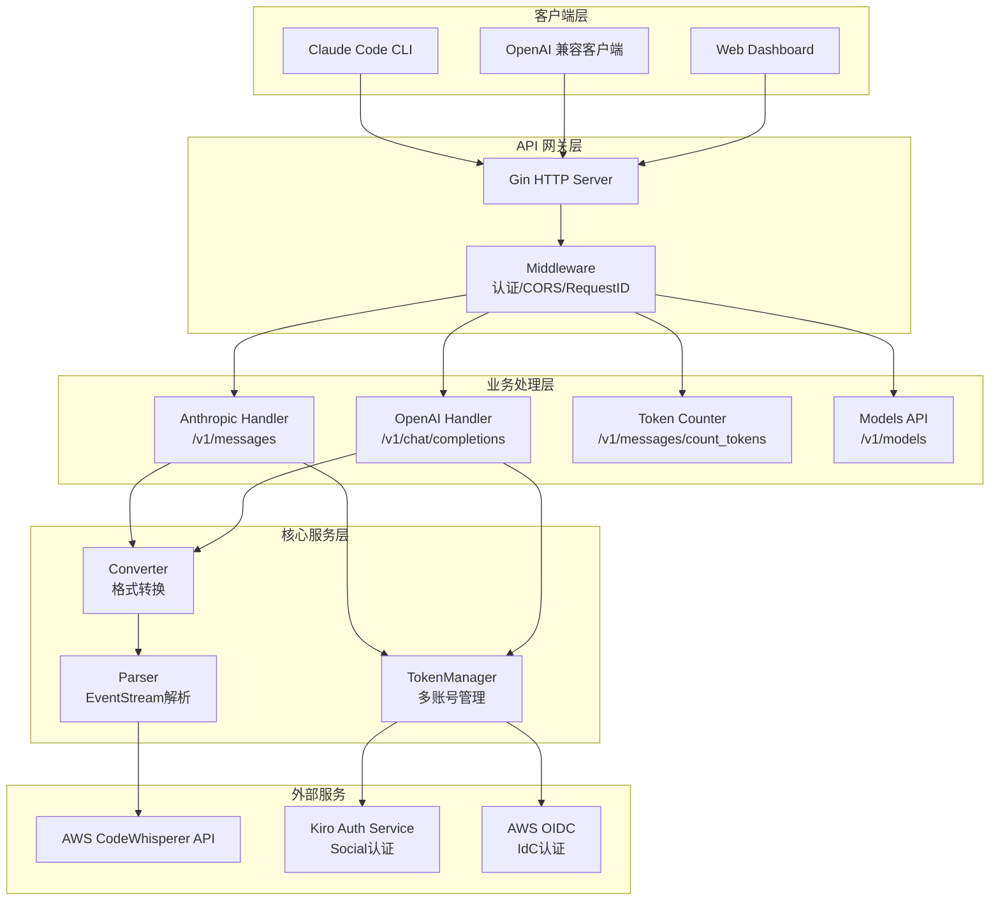
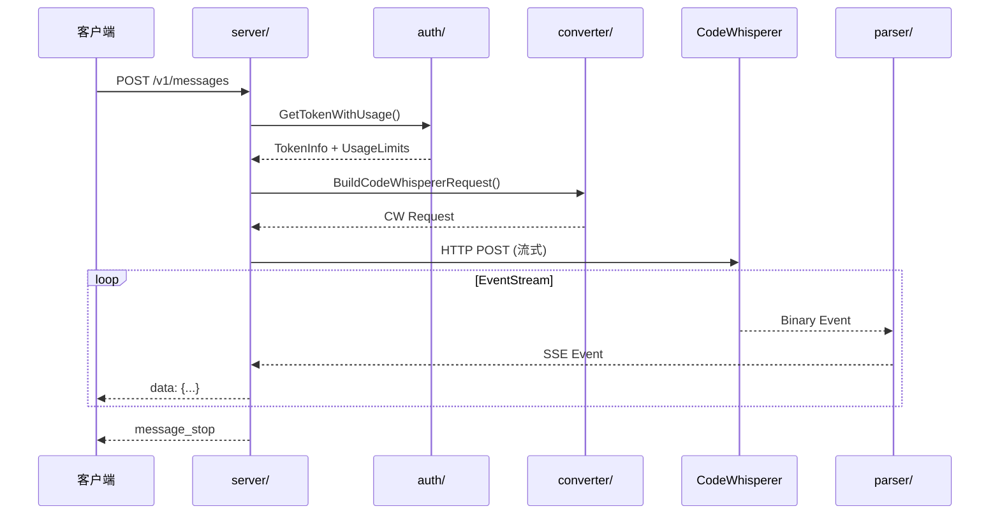

# CLAUDE.md

> 📅 最后更新: 2025-12-28 | 📊 覆盖率: 100% (8/8 模块)

This file provides guidance to Claude Code (claude.ai/code) when working with code in this repository.

## 项目概述

**kiro2api** - 高性能 AI API 代理服务器，桥接 Anthropic/OpenAI API 与 AWS CodeWhisperer。

**核心特性**：
- 🔄 双协议支持：Anthropic Messages API + OpenAI Chat Completions API
- 🌊 流式响应：零延迟 SSE 传输，实时 token 计数
- 🔧 工具调用：完整的 tool_use/tool_result 生命周期管理
- 🔐 多账号池：顺序选择策略，Social/IdC 双认证，自动额度监控
- 📊 Dashboard：实时 Token 池状态可视化

## 架构总览



## 模块索引

| 模块 | 职责 | 入口文件 | 测试覆盖 |
|------|------|----------|----------|
| [auth/](auth/CLAUDE.md) | Token 管理、刷新、使用限制检查 | `auth.go` | ✅ 3 个测试文件 |
| [config/](config/CLAUDE.md) | 配置常量、模型映射、调优参数 | `config.go` | ✅ 1 个测试文件 |
| [converter/](converter/CLAUDE.md) | API 格式转换 (Anthropic↔OpenAI↔CW) | `codewhisperer.go` | ✅ 3 个测试文件 |
| [logger/](logger/CLAUDE.md) | 结构化 JSON 日志 | `logger.go` | - |
| [parser/](parser/CLAUDE.md) | AWS EventStream 解析、工具生命周期 | `compliant_event_stream_parser.go` | ✅ 4 个测试文件 |
| [server/](server/CLAUDE.md) | HTTP 服务器、路由、处理器 | `server.go` | ✅ 6 个测试文件 |
| [types/](types/CLAUDE.md) | 数据结构定义 | `anthropic.go` | - |
| [utils/](utils/CLAUDE.md) | 工具函数、HTTP 客户端、Token 估算 | `client.go` | ✅ 4 个测试文件 |

## 请求流程



## 开发命令

```bash
# 编译和运行
go build -o kiro2api main.go
./kiro2api

# 测试
go test ./...                          # 运行所有测试
go test ./parser -v                    # 单包测试(详细输出)
go test ./... -bench=. -benchmem       # 基准测试

# 代码质量
go vet ./...                           # 静态检查
go fmt ./...                           # 格式化
golangci-lint run                      # Linter

# 运行模式
GIN_MODE=debug LOG_LEVEL=debug ./kiro2api  # 开发模式
GIN_MODE=release ./kiro2api                # 生产模式

# 生产构建
go build -ldflags="-s -w" -o kiro2api main.go
```

## 技术栈

| 类别 | 技术 | 版本 |
|------|------|------|
| 语言 | Go | 1.24.0 |
| Web 框架 | gin-gonic/gin | v1.11.0 |
| JSON 解析 | bytedance/sonic | v1.14.1 |
| 测试 | stretchr/testify | v1.11.1 |

## 核心架构

**请求流程**：认证 → 请求分析 → 格式转换 → 流处理 → 响应转换

**关键实现**：
- **Token 管理**：顺序选择策略，支持 Social/IdC 双认证
- **流式优化**：零延迟传输，直接内存分配（已移除对象池）
- **智能超时**：根据 MaxTokens、内容长度、工具使用动态调整
- **EventStream 解析**：`CompliantEventStreamParser`（BigEndian 格式）

## 开发原则

**内存管理**：
- 已移除 `sync.Pool` 对象池（KISS + YAGNI）
- 直接使用 `bytes.NewBuffer(nil)`、`strings.Builder`、`make([]byte, size)`
- 信任 Go 1.24 GC 和逃逸分析
- 仅在 QPS > 1000 且对象 > 10KB 时考虑对象池

**代码质量**：
- 遵循 KISS、YAGNI、DRY、SOLID 原则
- 避免过度抽象和预先优化
- 定期清理死代码和未使用功能
- 所有包测试通过率 100%

## 环境配置

详见 `.env.example` 和 `auth_config.json.example`。

**Token 配置方式**：
- JSON 字符串：`KIRO_AUTH_TOKEN='[{"auth":"Social","refreshToken":"xxx"}]'`
- 文件路径：`KIRO_AUTH_TOKEN=/path/to/auth_config.json`（推荐）

**配置字段**：`auth`（Social/IdC）、`refreshToken`、`clientId`、`clientSecret`、`disabled`

**关键环境变量**：
| 变量 | 说明 | 默认值 |
|------|------|--------|
| `KIRO_CLIENT_TOKEN` | API 认证密钥 | (必需) |
| `PORT` | 服务端口 | 8080 |
| `LOG_LEVEL` | 日志级别 | info |
| `LOG_FORMAT` | 日志格式 | json |
| `MAX_TOOL_DESCRIPTION_LENGTH` | 工具描述最大长度 | 10000 |

## 快速测试

```bash
# 启动服务
./kiro2api

# 测试 API
curl -X POST http://localhost:8080/v1/messages \
  -H "Authorization: Bearer 123456" \
  -H "Content-Type: application/json" \
  -d '{"model":"claude-sonnet-4-20250514","max_tokens":100,"messages":[{"role":"user","content":"测试"}]}'
```

## 文件统计

- **Go 源文件**: 54 个
- **测试文件**: 26 个
- **模块数量**: 8 个
