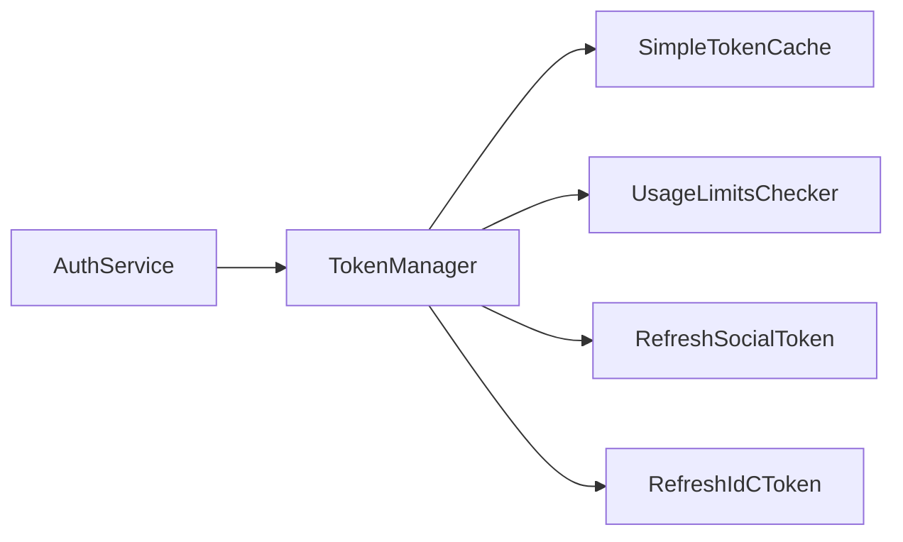

# auth/ 模块

> 🧭 [← 返回根目录](../CLAUDE.md) | 📦 kiro2api / auth

## 模块职责

Token 管理模块，负责多账号认证、Token 刷新、使用限制监控。

## 核心组件



## 文件清单

| 文件 | 职责 | 关键类型/函数 |
|------|------|---------------|
| `auth.go` | 认证服务入口 | `AuthService`, `NewAuthService()`, `GetToken()` |
| `token_manager.go` | Token 池管理 | `TokenManager`, `getBestToken()`, `selectBestTokenUnlocked()` |
| `config.go` | 配置加载 | `AuthConfig`, `loadConfigs()` |
| `refresh.go` | Token 刷新 | `RefreshSocialToken()`, `RefreshIdCToken()` |
| `usage_checker.go` | 使用限制检查 | `UsageLimitsChecker`, `CheckUsageLimits()` |

## 关键接口

```go
// AuthService - 认证服务主入口
type AuthService struct {
    tokenManager *TokenManager
    configs      []AuthConfig
}

func NewAuthService() (*AuthService, error)
func (as *AuthService) GetToken() (types.TokenInfo, error)
func (as *AuthService) GetTokenWithUsage() (*types.TokenWithUsage, error)

// TokenManager - Token 池管理器
type TokenManager struct {
    cache        *SimpleTokenCache
    configs      []AuthConfig
    currentIndex int             // 顺序选择策略
    exhausted    map[string]bool // 已耗尽记录
}
```

## 认证方式

| 类型 | 常量 | 刷新 URL |
|------|------|----------|
| Social | `AuthMethodSocial` | `https://prod.us-east-1.auth.desktop.kiro.dev/refreshToken` |
| IdC | `AuthMethodIdC` | `https://oidc.us-east-1.amazonaws.com/token` |

## Token 选择策略

采用**顺序选择策略**：
1. 从 `currentIndex` 开始遍历配置
2. 检查 Token 是否过期、是否可用
3. 可用则返回，不可用则标记为 `exhausted` 并移动到下一个
4. 所有 Token 不可用时返回错误

## 测试文件

- `auth_integration_test.go` - 集成测试
- `calculate_available_test.go` - 可用次数计算测试
- `token_manager_test.go` - Token 管理器测试

## 依赖关系

```
auth/
├── → config/     (TokenCacheTTL, TokenCacheKeyFormat)
├── → logger/     (日志记录)
├── → types/      (TokenInfo, UsageLimits, TokenWithUsage)
└── ← server/     (被 handlers 调用)
```
