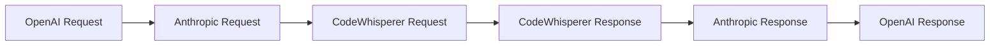

# converter/ 模块

> 🧭 [← 返回根目录](../CLAUDE.md) | 📦 kiro2api / converter

## 模块职责

API 格式转换模块，负责 Anthropic、OpenAI、CodeWhisperer 三种格式之间的转换。

## 核心流程



## 文件清单

| 文件 | 职责 | 关键函数 |
|------|------|----------|
| `codewhisperer.go` | Anthropic → CW 转换 | `BuildCodeWhispererRequest()` |
| `openai.go` | OpenAI ↔ Anthropic 转换 | `ConvertOpenAIToAnthropic()` |
| `content.go` | 消息内容处理 | `processMessageContent()` |
| `tools.go` | 工具格式转换 | `extractToolUsesFromMessage()`, `extractToolResultsFromMessage()` |

## 关键函数

### BuildCodeWhispererRequest

将 Anthropic 请求转换为 CodeWhisperer 格式：

```go
func BuildCodeWhispererRequest(anthropicReq types.AnthropicRequest, ctx *gin.Context) (types.CodeWhispererRequest, error)
```

**处理逻辑**：
1. 生成稳定的 `ConversationId` 和 `AgentContinuationId`
2. 确定 `ChatTriggerType`（MANUAL/AUTO）
3. 处理最后一条消息的内容和图片
4. 提取 `ToolResults`（如果有）
5. 转换工具定义（过滤不支持的工具如 `web_search`）
6. 构建历史消息（user/assistant 配对）

### ConvertOpenAIToAnthropic

将 OpenAI 请求转换为 Anthropic 格式：

```go
func ConvertOpenAIToAnthropic(openaiReq types.OpenAIRequest) types.AnthropicRequest
```

## 工具处理

### 不支持的工具（静默过滤）
- `web_search`
- `websearch`

### 工具描述长度限制
- 最大长度：`config.MaxToolDescriptionLength`（默认 10000）
- 超长自动截断

## 历史消息配对逻辑

```
user1 → assistant1 → user2 → assistant2 → user3(current)
        ↓
history: [user1+assistant1, user2+assistant2]
currentMessage: user3
```

**特殊处理**：
- 连续 user 消息：合并后配对
- 孤立 user 消息：自动配对 "OK" 响应
- 孤立 assistant 消息：忽略

## 测试文件

- `codewhisperer_test.go` - CW 转换测试
- `openai_test.go` - OpenAI 转换测试
- `tools_test.go` - 工具处理测试

## 依赖关系

```
converter/
├── → config/     (ModelMap, MaxToolDescriptionLength)
├── → logger/     (日志记录)
├── → types/      (请求/响应结构)
├── → utils/      (GetMessageContent, GenerateStableConversationID)
└── ← server/     (被 handlers 调用)
```
