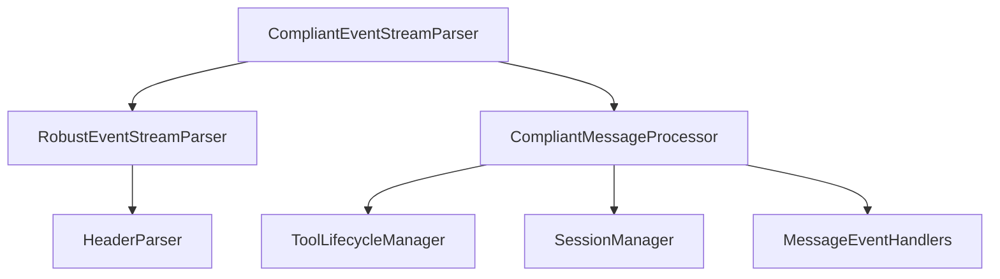
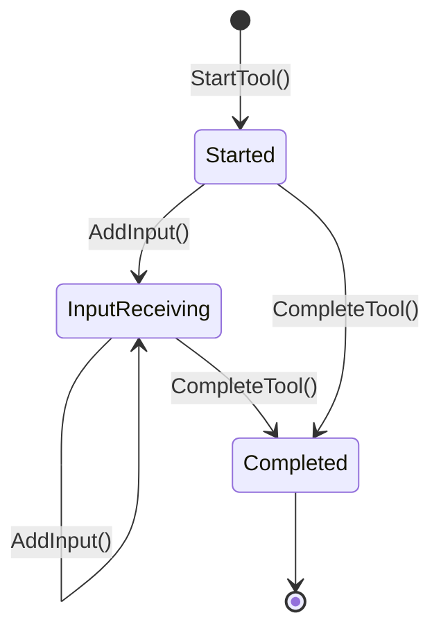

# parser/ 模块

> 🧭 [← 返回根目录](../CLAUDE.md) | 📦 kiro2api / parser

## 模块职责

AWS EventStream 二进制协议解析模块，负责解析 CodeWhisperer 响应并转换为 SSE 事件。

## 核心组件



## 文件清单

| 文件 | 职责 | 关键类型/函数 |
|------|------|---------------|
| `compliant_event_stream_parser.go` | 主解析器入口 | `CompliantEventStreamParser`, `ParseResponse()`, `ParseStream()` |
| `compliant_message_processor.go` | 消息处理器 | `CompliantMessageProcessor`, `ProcessMessage()` |
| `robust_parser.go` | 健壮的二进制解析 | `RobustEventStreamParser`, `ParseStream()` |
| `header_parser.go` | 头部解析 | `ParseHeaders()` |
| `event_stream_types.go` | 类型定义 | `EventStreamMessage`, `SSEEvent`, `MessageTypes`, `EventTypes` |
| `message_event_handlers.go` | 事件处理器 | `handleAssistantResponseEvent()` |
| `tool_lifecycle_manager.go` | 工具生命周期 | `ToolLifecycleManager`, `StartTool()`, `CompleteTool()` |
| `session_manager.go` | 会话管理 | `SessionManager`, `GetSessionInfo()` |
| `sonic_streaming_aggregator.go` | 流式 JSON 聚合 | `SonicStreamingAggregator` |

## AWS EventStream 格式

```
+----------------+----------------+----------------+
| Total Length   | Headers Length | Prelude CRC    |
| (4 bytes)      | (4 bytes)      | (4 bytes)      |
+----------------+----------------+----------------+
| Headers        | Payload        | Message CRC    |
| (variable)     | (variable)     | (4 bytes)      |
+----------------+----------------+----------------+
```

**关键特性**：
- BigEndian 字节序
- 最小消息长度：16 字节
- 最大消息长度：16 MB

## 消息类型

```go
var MessageTypes = struct {
    EVENT     string
    ERROR     string
    EXCEPTION string
}{
    EVENT:     "event",
    ERROR:     "error",
    EXCEPTION: "exception",
}
```

## 事件类型

```go
var EventTypes = struct {
    ASSISTANT_RESPONSE_EVENT string
    TOOL_CALL_REQUEST        string
    TOOL_CALL_ERROR          string
    // ...
}{
    ASSISTANT_RESPONSE_EVENT: "assistantResponseEvent",
    TOOL_CALL_REQUEST:        "toolCallRequest",
    // ...
}
```

## 工具生命周期



## 测试文件

- `event_stream_types_test.go` - 类型测试
- `header_parser_test.go` - 头部解析测试
- `message_event_handlers_test.go` - 事件处理测试
- `sonic_streaming_aggregator_test.go` - 流式聚合测试

## 依赖关系

```
parser/
├── → config/     (EventStream 常量)
├── → logger/     (日志记录)
├── → types/      (AssistantResponseEvent)
└── ← server/     (被 stream_processor 调用)
```
