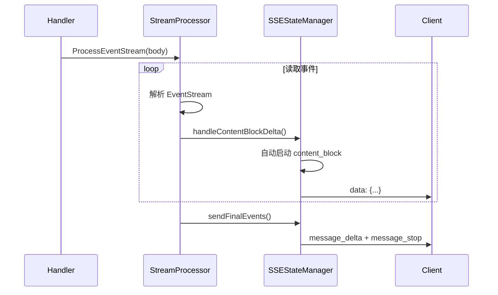

# server/ 模块

> 🧭 [← 返回根目录](../CLAUDE.md) | 📦 kiro2api / server

## 模块职责

HTTP 服务器模块，包含路由、处理器、中间件、流式处理。

## 核心组件

```mermaid
graph TB
    S[StartServer] --> R[Gin Router]
    R --> MW[Middleware]
    MW --> H1[/v1/messages]
    MW --> H2[/v1/chat/completions]
    MW --> H3[/v1/messages/count_tokens]
    MW --> H4[/v1/models]
    MW --> H5[/api/tokens]
    H1 --> SP[StreamProcessor]
    H2 --> SP
    SP --> SSE[SSEStateManager]
    SP --> SRM[StopReasonManager]
```

## 文件清单

| 文件 | 职责 | 关键函数/类型 |
|------|------|---------------|
| `server.go` | 服务器入口和路由 | `StartServer()` |
| `handlers.go` | Anthropic 请求处理 | `handleStreamRequest()`, `handleNonStreamRequest()` |
| `openai_handlers.go` | OpenAI 请求处理 | `handleOpenAIStreamRequest()` |
| `stream_processor.go` | 流式处理核心 | `EventStreamProcessor`, `ProcessEventStream()` |
| `sse_state_manager.go` | SSE 状态管理 | `SSEStateManager`, `handleContentBlockDelta()` |
| `stop_reason_manager.go` | 停止原因管理 | `StopReasonManager`, `DetermineStopReason()` |
| `middleware.go` | 中间件 | `PathBasedAuthMiddleware()`, `RequestIDMiddleware()` |
| `common.go` | 公共工具 | `RequestContext`, `respondError()` |
| `error_mapper.go` | 错误映射 | `MapCodeWhispererError()` |
| `count_tokens_handler.go` | Token 计数 | `handleCountTokens()` |

## API 端点

| 方法 | 路径 | 说明 | 认证 |
|------|------|------|------|
| GET | `/` | Dashboard 页面 | 否 |
| GET | `/static/*` | 静态资源 | 否 |
| GET | `/api/tokens` | Token 池状态 | 否 |
| GET | `/v1/models` | 模型列表 | 是 |
| POST | `/v1/messages` | Anthropic API | 是 |
| POST | `/v1/messages/count_tokens` | Token 计数 | 是 |
| POST | `/v1/chat/completions` | OpenAI API | 是 |

## 流式处理流程



## SSE 事件序列

```
message_start
ping
content_block_start (index=0, type=text)
content_block_delta (index=0, delta.text="...")
content_block_stop (index=0)
content_block_start (index=1, type=tool_use)
content_block_delta (index=1, delta.partial_json="...")
content_block_stop (index=1)
message_delta (stop_reason="tool_use")
message_stop
```

## Stop Reason 规范

| 值 | 说明 |
|-----|------|
| `end_turn` | 正常结束 |
| `tool_use` | 需要执行工具 |
| `max_tokens` | 达到 token 上限 |
| `stop_sequence` | 遇到停止序列 |

## 测试文件

- `common_test.go` - 公共工具测试
- `count_tokens_handler_test.go` - Token 计数测试
- `error_mapper_test.go` - 错误映射测试
- `handlers_test.go` - 处理器测试
- `middleware_test.go` - 中间件测试

## 依赖关系

```
server/
├── → auth/       (AuthService, GetTokenWithUsage)
├── → config/     (MessageIDFormat, ParserMaxErrors)
├── → converter/  (BuildCodeWhispererRequest, ConvertOpenAIToAnthropic)
├── → logger/     (日志记录)
├── → parser/     (CompliantEventStreamParser)
├── → types/      (请求/响应结构)
└── → utils/      (HTTP 工具, Token 估算)
```
